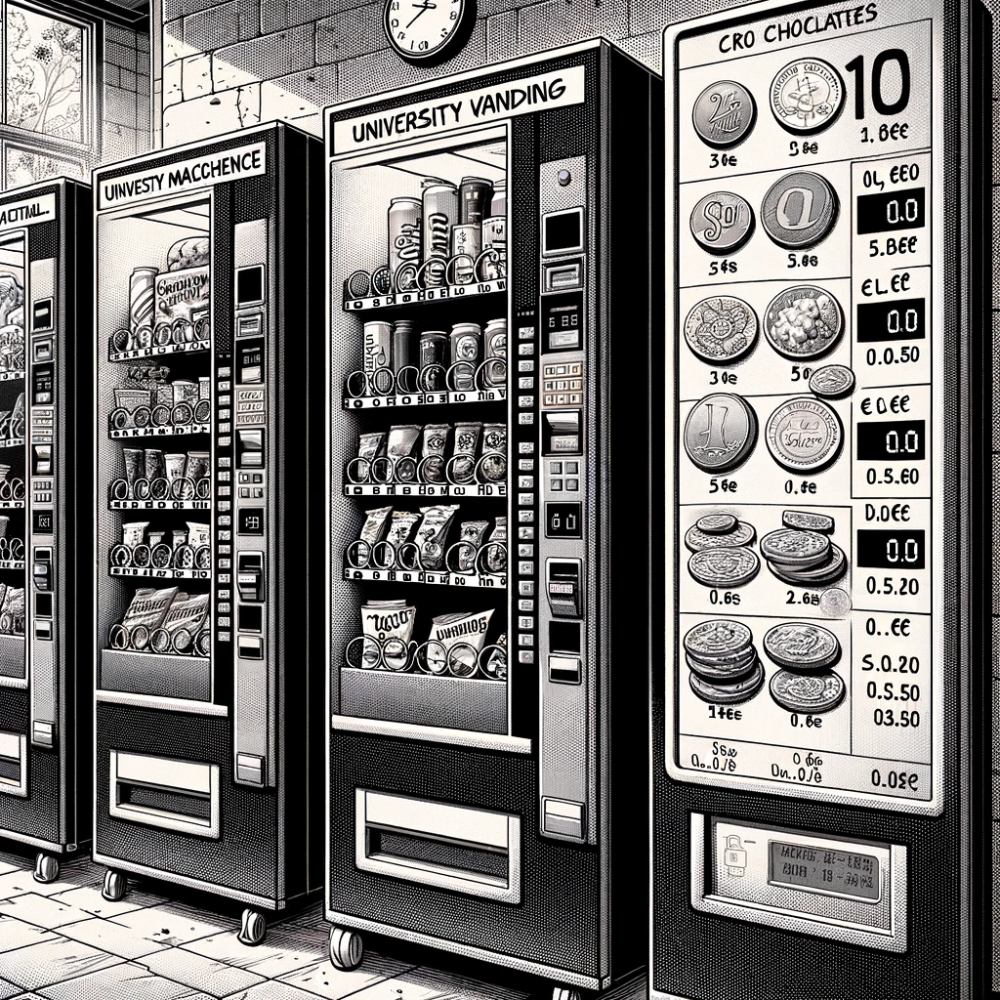

# pyExpendedoras

## Contexto

La máquina expendedora es una máquina que proporciona aperitivos, bebidas, golosinas y otros productos a los consumidores. Se trata de vender sin la presencia de un dependiente para cobrar los artículos. Periódicamente un empleado repone el producto y recoge el dinero en forma de monedas o, menos habitualmente, billetes; a veces también se puede pagar con tarjeta monedero, tarjeta de crédito o teléfono móvil.

Una máquina expendedora en inglés se conoce como *vending machine*. Por eso, la palabra *vending* se utiliza con frecuencia para referirse al sector de las máquinas expendedoras y siempre se encuentran diferentes tipos y variaciones de esta misma.

Las máquinas expendedoras podrían tener su origen en Egipto, pues la primera de ellas de la que se tiene constancia escrita fue diseñada por Herón de Alejandría para dispensar agua bendita en los templos de Tebas y el alto Egipto.

A pesar de este inicio, las máquinas expendedoras se desarrollan con la Revolución industrial. En Londres, (Inglaterra), al principio de la década de 1880, se empezó a utilizar las primeras máquinas modernas que vendían tarjetas postales. En Estados Unidos, en 1888, la compañía Thomas Adams Gum Company instala máquinas dispensadoras de chicle o goma de mascar en los andenes del metro de Nueva York. En 1946, las máquinas dispensadoras de café caliente marcan un hito en la historia de las máquinas expendedoras porque las que venden café se extienden por todo el mundo. En la década siguiente hace su aparición la primera máquina refrigerada de venta de sándwiches.

En 1960 las máquinas se modernizan y ya es posible pagar tanto en monedas como en billetes. Con el desarrollo de los componentes electrónicos, en 1985 las máquinas aceptan como medio de pago tarjetas de crédito y débito.

El alumno del grado de Ingeniería Informática H.D.R.B. ha aplicado los conocimientos adquiridos en la asignatura de Programación I, logrando implementar un sistema que le permite gestionar las máquinas expendedoras de la universidad, cuyas características y condiciones iniciales se detallan a continuación:

Producto|Precio|Cantidad en Máquina 1|Cantidad en Máquina 2|Cantidad en Máquina 3
-|-|-|-|-
Galletas|1,50|10|10|10
Chocolates|1,10|10|10|10
Bebida|1,05|10|10|10
Bocadillo|1,75|10|10|10

Estas máquinas expendedoras permiten pagar con los siguientes billetes y monedas (otras denominaciones no son aceptadas):

||Cantidad en Máquina 1|Cantidad en Máquina 2|Cantidad en Máquina 3
-|-|-|-
20 €|3|3|3
10 €|1|2|1
5 €|2|3|3
2 €|5|7|5
1 €|10|15|12
0,5 €|20|25|30
0,2 €|20|30|10
0,05 €|10|20|15

## Requisitos 

1. Desarrolle el código que permita gestionar la máquina expendedora N, simulando el proceso de compra/venta y la gestión del dinero. Se debe tener en cada momento constancia del número de productos que tiene la máquina, así como del dinero (total y parcial).
1. Dote a este código de la opción para obtener un reporte de la cantidad de producto de la máquina. 
1. Dote a este código de la opción para obtener un reporte de la cantidad de dinero que hay en la máquina.
1. El código debe estar preparado para gestionar tres máquinas.

## Retos Avanzados

- Amplíe el sistema para permitir la inclusión de nuevos tipos de productos con características específicas (productos perecederos con fecha de caducidad, productos refrigerados, productos que requieren verificación de edad).
- El sistema debe permitir añadir nuevas máquinas sin modificar el código existente.
- Implemente un sistema que permita a diferentes componentes suscribirse a eventos generados por las máquinas expendedoras (niveles bajos de inventario, fallos, ventas exitosas).
- Modele los diferentes estados de una máquina expendedora (operativa, en mantenimiento, fuera de servicio, modo reposición) y las transiciones entre ellos.
- Implemente diferentes estrategias de cálculo de precios (precios normales, descuentos por volumen, ofertas temporales).
- Desarrolle distintas estrategias de devolución de cambio (priorizar monedas grandes, priorizar monedas pequeñas, equilibrado).
- Añada un mecanismo para guardar y recuperar el estado completo del sistema de máquinas expendedoras.
- Implemente una solución que permita que el sistema se recupere adecuadamente tras un fallo o interrupción.
- Añada la opción de gestionar la reposición de las máquinas. Esta reposición "llena" las máquinas, llevándolas al estado inicial de 10 productos por máquina.
- Implemente un sistema de predicción de consumo que sugiera cuándo y qué productos reponer.

### Escenarios++

- Durante la venta, la probabilidad que haya un atasco es del 2%. Incluya el código para simular esta situación.
- Durante la venta, la probabilidad que haya una avería es del 3%. Incluya el código para simular esta situación.
